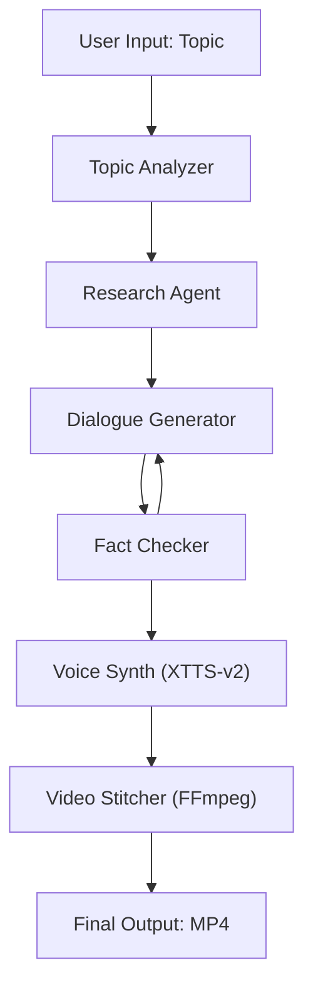

# 📄 Design Document: _“Brainrot Explainer Generator” (MVP)_

## 🎯 Goal

Build a LangGraph-powered pipeline that generates 2-character dialogue-based educational meme videos. Each video:

-   Takes a user topic
-   Creates a comedic yet factual dialogue between 2 hardcoded personas
-   Synthesizes speech using **XTTS-v2**
-   Overlays voices & subtitles on local gameplay footage

---

## 🧠 Agent Flow (Simplified for MVP)



---

## 🧱 Component Breakdown

### 1. 🧾 **Topic Analyzer Agent**

-   Classifies input (e.g., “Quantum Physics” → STEM)
-   Optional: breaks it down into 2–3 bullet-sized subtopics
    **Input:** `"Explain quantum entanglement"`
    **Output:** `"Entanglement basics, Bell's theorem, spooky action"`

---

### 2. 🔍 **Research Agent**

-   Uses either GPT-4, static knowledge, or a scraping tool
-   Extracts \~3 factual points for each character to expand on
    **Example Output:**

```json
[
	"Entangled particles remain connected no matter the distance.",
	"Measuring one affects the other instantly.",
	"Einstein called it 'spooky action at a distance.'"
]
```

---

### 3. 🗣️ **Dialogue Generator Agent**

-   Input: facts + character names (hardcoded)
-   Output: humorous but informative back-and-forth script
    **Example Output:**

```json
[
	{
		"speaker": "Saul Goodman",
		"line": "So you’re telling me these particles text each other instantly across space?"
	},
	{
		"speaker": "Walter White",
		"line": "Yes, Saul. Entanglement is quantum DMs."
	}
]
```

---

### 4. 🧠 **Fact Checker Agent**

-   Reruns the full dialogue through the LLM to:

    -   Match against original facts
    -   Avoid major hallucinations or oversimplifications

---

### 5. 🧵 **Voice Synth Agent (XTTS-v2)**

-   For each line:

    -   Looks up speaker → loads reference .wav (voice clone seed)
    -   Feeds line to XTTS-v2 → outputs `.wav` file

-   Uses consistent voice cloning seed per character

> _e.g., Saul Goodman lines voiced via saul.wav clone, saved as saul_line_01.wav_

---

### 6. 🎬 **Video Stitcher**

-   Takes:

    -   Local looping gameplay video
    -   Generated voice lines + timestamps
    -   Text captions (hardcoded or styled per character)

-   Uses **FFmpeg** to:

    -   Mix audio + background
    -   Burn captions in
    -   Export final `.mp4`

---

## 🗂️ Directory Structure Example

```
project/
│
├── assets/
│   ├── voices/
│   │   ├── saul.wav
│   │   └── walter.wav
│   └── broll/
│       └── subway_surfer_loop.mp4
│
├── output/
│   ├── audio/
│   └── final_video.mp4
│
├── agents/
│   ├── topic_analyzer.py
│   ├── research.py
│   ├── dialogue_gen.py
│   ├── fact_check.py
│   ├── voice_synth_xtts.py
│   └── video_stitcher.py
```

---

## ✅ MVP Constraints

| Feature    | Choice                                    |
| ---------- | ----------------------------------------- |
| Characters | Fixed (e.g., Saul Goodman & Walter White) |
| TTS        | XTTS-v2, local clone from `.wav`          |
| B-roll     | Static file (`/assets/broll/*.mp4`)       |
| Output     | Final `.mp4` with voices and captions     |
| Interface  | CLI or notebook                           |
| LLM        | Local or OpenAI, via prompt chaining      |
